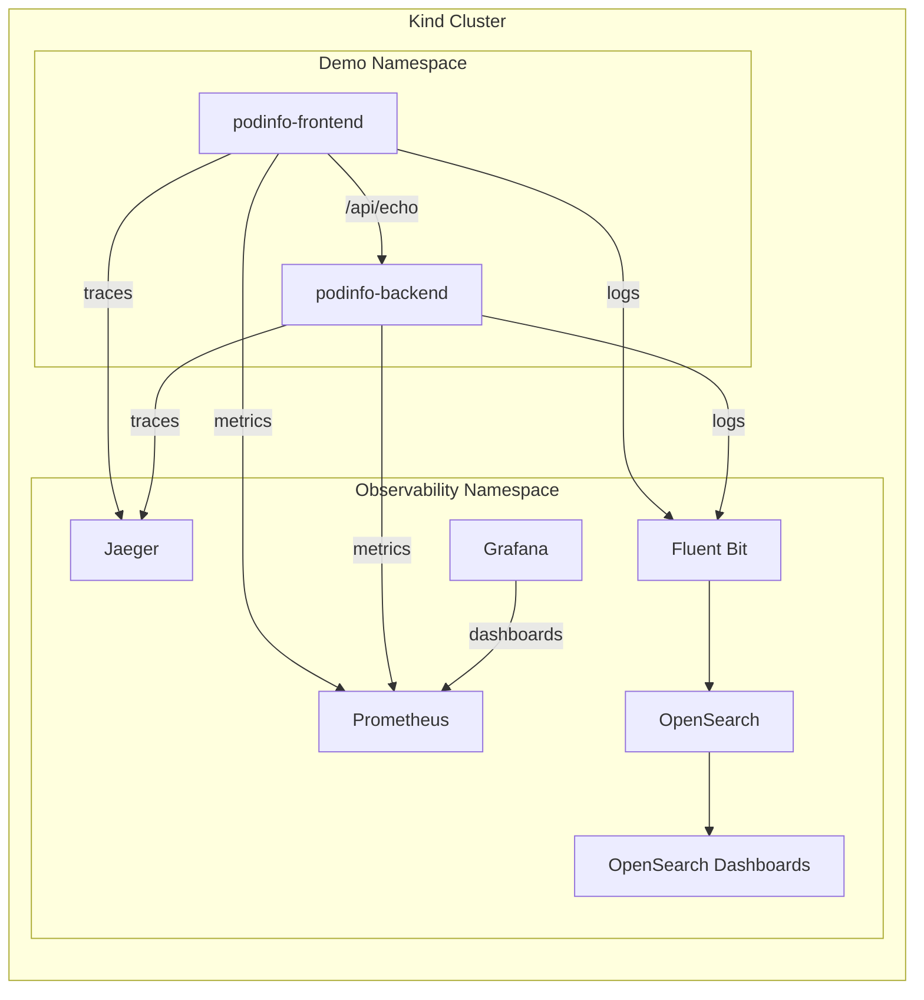

# kind-stack-observability
A local Kubernetes **observability stack** running on a **kind** cluster.

Built for **development and learning**. Quick to spin up, quick to tear down.

---

## Quickstart (TL;DR)
```bash
make kind-up      # create cluster
make deploy       # validate and deploy stack
make health-check # verify everything is running
make pf-all       # port-forward all UIs
```

Open:
- Prometheus -> [http://localhost:9090](http://localhost:9090)
- Alertmanager -> [http://localhost:9093](http://localhost:9093)
- Grafana -> [http://localhost:3000](http://localhost:3000) (admin/admin)
- OpenSearch Dashboards -> [http://localhost:5601](http://localhost:5601)
- Jaeger UI -> [http://localhost:16686](http://localhost:16686)
- podinfo-frontend -> [http://localhost:8080](http://localhost:8080)
- podinfo-backend -> [http://localhost:8081](http://localhost:8081)

---

## Prerequisites
- Docker
- kind
- kubectl
- helm
- helmfile

Configure Docker Desktop with at least 8GB memory for things to run smoothly.

---

## Defaults (Ports, Auth, Namespaces)

| Component             | Namespace     | URL / Port                                       | Auth          | Notes                         |
| --------------------- | ------------- | ------------------------------------------------ | ------------- | ----------------------------- |
| Prometheus            | observability | [http://localhost:9090](http://localhost:9090)   | none          | no persistence, sample alerts |
| Alertmanager          | observability | [http://localhost:9093](http://localhost:9093)   | none          | no persistence                |
| Grafana               | observability | [http://localhost:3000](http://localhost:3000)   | admin / admin | no persistence                |
| OpenSearch API        | observability | [http://localhost:9200](http://localhost:9200)   | none          | security disabled             |
| OpenSearch Dashboards | observability | [http://localhost:5601](http://localhost:5601)   | none          | security disabled             |
| Jaeger UI             | observability | [http://localhost:16686](http://localhost:16686) | none          | no persistence                |
| Podinfo Frontend      | demo          | [http://localhost:8080](http://localhost:8080)   | none          | web UI, `/api/echo` endpoint  |
| Podinfo Backend       | demo          | [http://localhost:8081](http://localhost:8081)   | none          | backend echo service          |

Deployment is handled by Helm via Helmfile, with make commands simplifying all operations.

---

## Architecture


---

## Sample App: podinfo
[podinfo](https://github.com/stefanprodan/podinfo) lives in the `demo` namespace and produces both logs and metrics for testing.
- **podinfo-frontend** (port 8080) - Frontend service with web UI
- **podinfo-backend** (port 8081) - Backend service for echo requests

Podinfo exposes `/metrics` (Prometheus), `/api/echo` (backend communication), and standard health endpoints. Test frontend-to-backend communication:

```bash
curl -X POST http://localhost:8080/api/echo -d '{"test":"frontend-to-backend"}'

Expected response:
[
  "{\"test\":\"frontend-to-backend\"}"
]
```

---

## Verify Observability

Generate traffic to test the stack:
```bash
for i in {1..10}; do curl -s localhost:8080/ > /dev/null; done
```

**Metrics** - Prometheus ([http://localhost:9090](http://localhost:9090))
```text
Query: http_requests_total{app="podinfo"}
```

**Dashboards** - Grafana ([http://localhost:3000](http://localhost:3000))
```text
Query: rate(http_requests_total{app="podinfo"}[1m])
```

**Logs** - OpenSearch Dashboards ([http://localhost:5601](http://localhost:5601))
```text
Discover -> Index: kubernetes-logs* -> Filter: kubernetes.namespace_name:"demo"
```

**Traces** - Jaeger UI ([http://localhost:16686](http://localhost:16686))
```text
Service: podinfo-frontend or podinfo-backend -> Find Traces
```

**Alerts** - Alertmanager ([http://localhost:9093](http://localhost:9093))
```text
View active alerts, silences, and alert groups
Alerts -> Shows all firing and pending alerts
```

---

## Troubleshooting
```bash
# Port conflicts - stop all port-forwards
make pf-stop

# Pods failing - check status and describe pod
kubectl get pods -A
kubectl describe pod <name> -n <namespace>

# Deployment issues - validate and redeploy component
make validate
helmfile -l name=<component> apply

# Get logs from a component
kubectl logs -n observability deployment/<component> --tail=20

# Check health of services
./scripts/health-check.sh
curl http://localhost:9090/api/v1/targets
```

---

## Tear Down
```bash
make destroy    # remove Helm releases
make kind-down  # delete the kind cluster
```

---

## Notes
- OpenSearch is single node and unsecured (dev only).
- Fluent Bit forwards all container logs to OpenSearch.
- Jaeger uses all-in-one deployment with no persistence.
- podinfo pods are for validating end to end observability.
- Prometheus and Grafana have no persistence to support an ephemeral workflow.
- The stack is intended for short lived, iterative demo environments.


