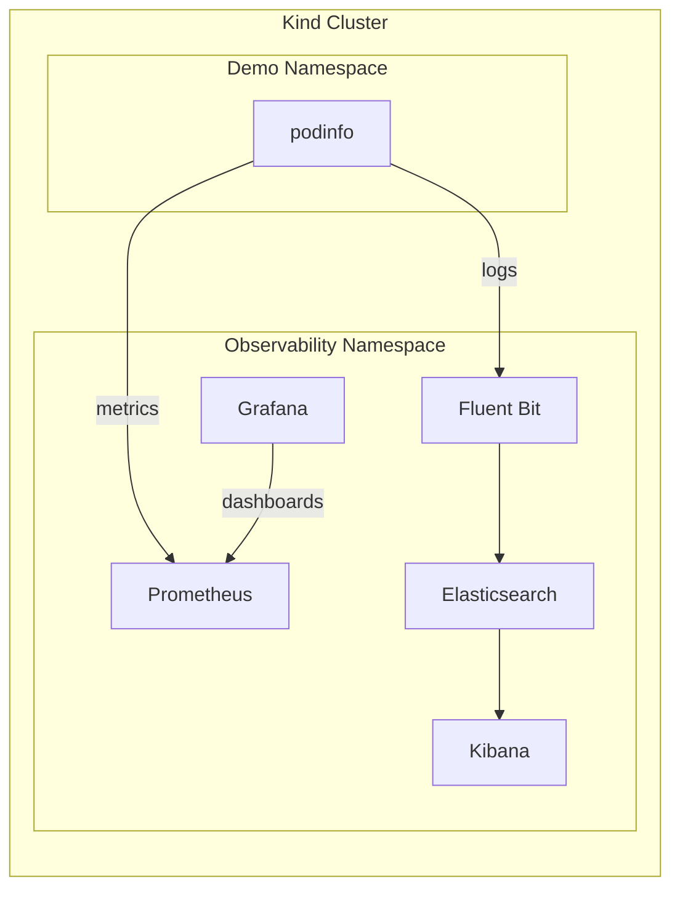

# kind-stack-observability
A local Kubernetes **observability stack** running on a **kind** cluster.

Built for **development and demos only**. Quick to spin up, quick to tear down.

---

## Quickstart (TL;DR)
```bash
make kind-up  # create cluster
make deploy   # deploy stack and sample app
make status   # verify pods
make pf-all   # port-forward all UIs (Prometheus, Grafana, Kibana, podinfo)
```

Open:
- Prometheus → [http://localhost:9090](http://localhost:9090)
- Grafana → [http://localhost:3000](http://localhost:3000) (admin/admin)
- Kibana → [http://localhost:5601](http://localhost:5601)
- podinfo → [http://localhost:8080](http://localhost:8080)

---

## Prerequisites
- Docker
- kind
- kubectl
- helm
- helmfile

---

## Defaults (Ports, Creds, Namespaces)

| Component  | Namespace     | URL / Port                                     | Auth          | Notes                             |
| ---------- | ------------- | ---------------------------------------------- | ------------- | --------------------------------- |
| Prometheus | observability | [http://localhost:9090](http://localhost:9090) | none          | no persistence                    |
| Grafana    | observability | [http://localhost:3000](http://localhost:3000) | admin / admin | no persistence                    |
| Kibana     | observability | [http://localhost:5601](http://localhost:5601) | none          | ES unsecured                      |
| podinfo    | demo          | [http://localhost:8080](http://localhost:8080) | none          | `/readyz`, `/healthz`, `/metrics` |

Deployment is handled by Helm via Helmfile, with make commands simplifying all operations.

---

## Architecture


---

## Sample App: podinfo
podinfo lives in the `demo` namespace and produces both logs and metrics for testing the pipeline.

Endpoints: `/`, `/readyz`, `/healthz`, `/metrics` (9898)

No manual port-forwarding needed when using `make pf-all`.

---

## Verify Metrics (Prometheus + Grafana)
1. Generate traffic:
```bash
curl -s localhost:8080/
curl -s localhost:8080/{readyz,healthz}
```

2. Prometheus ([http://localhost:9090](http://localhost:9090)):
```text
http_requests_total{app="podinfo"}
```

3. Grafana ([http://localhost:3000](http://localhost:3000)):
```text
rate(http_requests_total{app="podinfo"}[1m])
```

---

## Verify Logs (Kibana)
1. Kibana → Discover

2. Index:
```text
kubernetes-logs*
```

3. Filter:
```text
kubernetes.namespace_name:"demo"
```

4. Hit podinfo again and refresh:
```bash
curl -s localhost:8080/
```

---

## Tear Down
```bash
make destroy    # remove Helm releases
make kind-down  # delete the kind cluster
```

---

## Notes
- Elasticsearch is single node and unsecured (dev only).
- Fluent Bit forwards all container logs to Elasticsearch.
- podinfo is the traffic + metrics source for validating end to end observability.
- Prometheus and Grafana are non persistent to support an ephemeral workflow.
- The stack is intended for short lived, iterative demo environments.

