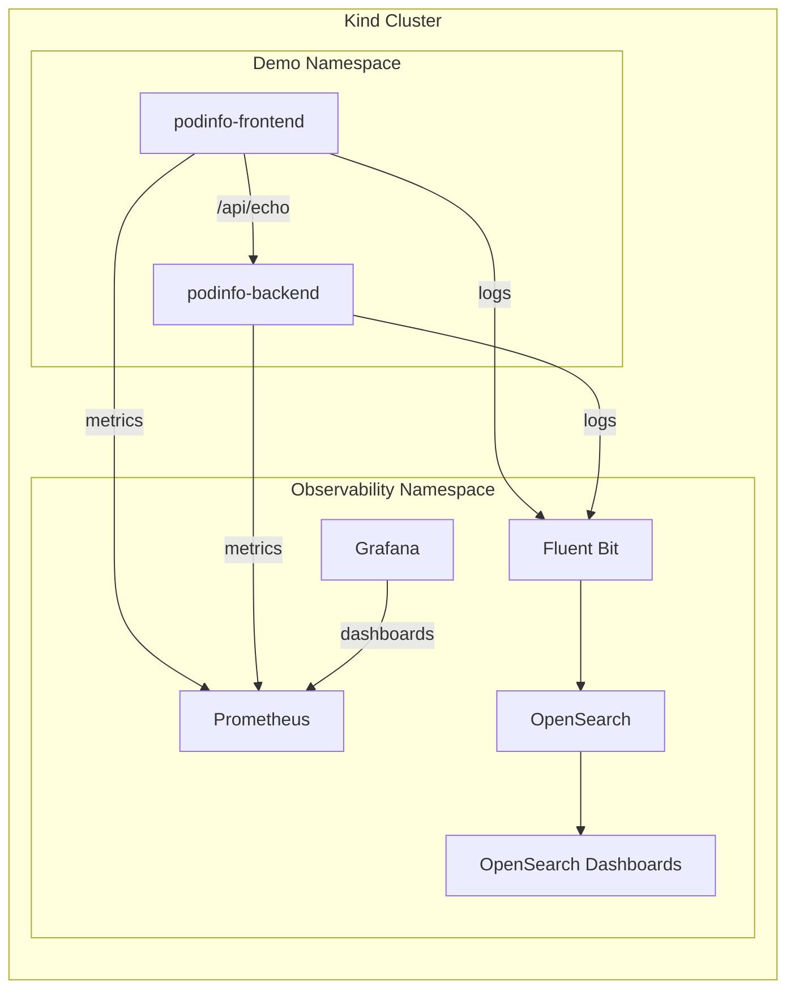

# kind-stack-observability
A local Kubernetes **observability stack** running on a **kind** cluster.

Built for **development and demos only**. Quick to spin up, quick to tear down.

---

## Quickstart (TL;DR)
```bash
make kind-up      # create cluster
make deploy       # validate and deploy stack
make health-check # verify everything is running
make pf-all       # port-forward all UIs
```

Open:
- Prometheus → [http://localhost:9090](http://localhost:9090)
- Grafana → [http://localhost:3000](http://localhost:3000) (admin/admin)
- OpenSearch Dashboards → [http://localhost:5601](http://localhost:5601)
- podinfo-frontend → [http://localhost:8080](http://localhost:8080)
- podinfo-backend → [http://localhost:8081](http://localhost:8081)

---

## Prerequisites
- Docker
- kind
- kubectl
- helm
- helmfile

Configure Docker Desktop with at least 8GB memory for things to run smoothly.

---

## Defaults (Ports, Auth, Namespaces)

| Component             | Namespace     | URL / Port                                     | Auth          | Notes                        |
| --------------------- | ------------- | ---------------------------------------------- | ------------- | ---------------------------- |
| Prometheus            | observability | [http://localhost:9090](http://localhost:9090) | none          | no persistence               |
| Grafana               | observability | [http://localhost:3000](http://localhost:3000) | admin / admin | no persistence               |
| OpenSearch API        | observability | [http://localhost:9200](http://localhost:9200) | none          | security disabled            |
| OpenSearch Dashboards | observability | [http://localhost:5601](http://localhost:5601) | none          | security disabled            |
| podinfo-frontend      | demo          | [http://localhost:8080](http://localhost:8080) | none          | web UI, `/api/echo` endpoint |
| podinfo-backend       | demo          | [http://localhost:8081](http://localhost:8081) | none          | backend echo service         |

Deployment is handled by Helm via Helmfile, with make commands simplifying all operations.

---

## Architecture


---

## Sample App: podinfo
podinfo lives in the `demo` namespace and produces both logs and metrics for testing.
- **podinfo-frontend** (port 8080) - Frontend service with web UI
- **podinfo-backend** (port 8081) - Backend service for echo requests

Endpoints:
  - `/`
  - `/env`
  - `/headers`
  - `/healthz`
  - `/readyz`
  - `/metrics`


Test that the frontend can successfully communicate with the backend.

```bash
curl -X POST http://localhost:8080/api/echo -d '{"test":"frontend-to-backend"}'

Expected response:
[
  "{\"test\":\"frontend-to-backend\"}"
]
```

---

## Verify Metrics (Prometheus + Grafana)
1. Generate traffic:
```bash
curl -s localhost:8080/
curl -s localhost:8080/{readyz,healthz}
```

2. Prometheus ([http://localhost:9090](http://localhost:9090)):
```text
http_requests_total{app="podinfo"}
```

3. Grafana ([http://localhost:3000](http://localhost:3000)):
```text
rate(http_requests_total{app="podinfo"}[1m])
```

---

## Verify Logs (OpenSearch Dashboards)
1. OpenSearch Dashboards → Discover

2. Index:
```text
kubernetes-logs*
```

3. Filter:
```text
kubernetes.namespace_name:"demo"
```

4. Hit podinfo again and refresh:
```bash
curl -s localhost:8080/
```

---

## Tear Down
```bash
make destroy    # remove Helm releases
make kind-down  # delete the kind cluster
```

---

## Notes
- OpenSearch is single node and unsecured (dev only).
- Fluent Bit forwards all container logs to OpenSearch.
- podinfo pods are for validating end to end observability.
- Prometheus and Grafana are non persistent to support an ephemeral workflow.
- The stack is intended for short lived, iterative demo environments.
